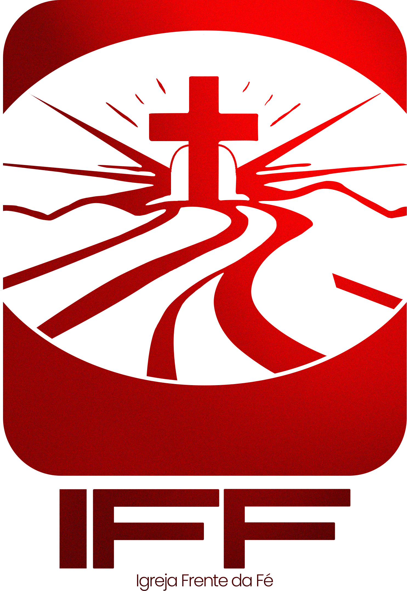

# ⛪ Frente da Fé

<div align="center">



### Um portal moderno para conectar pessoas, fortalecer a comunidade e facilitar a gestão da igreja.


</div>

---

## 📖 Sobre

O **Frente da Fé** é um portal desenvolvido para proporcionar uma experiência moderna aos visitantes e membros da igreja.

O projeto foi pensado para unir uma identidade visual contemporânea com funcionalidades que aproximam pessoas da comunidade, oferecendo uma navegação intuitiva e agradável.

---

## ✨ Funcionalidades

- 🏠 Landing Page institucional
- ⛪ Página sobre a igreja
- 📅 Agenda de cultos
- 🎉 Eventos
- ❤️ Quero Fazer Parte
- 💳 Página de doações
- 📞 Contato
- 🔐 Login
- 📱 Layout totalmente responsivo
- ⚡ Navegação rápida utilizando TanStack Router
- 🎨 Interface moderna com Tailwind CSS
- ✨ Animações suaves com Framer Motion

---

# 🖼️ Preview

> Em breve...

---

# 🛠️ Tecnologias

- React 19
- TypeScript
- Vite
- Tailwind CSS
- TanStack Router
- Framer Motion
- Lucide React

---

# 📂 Estrutura

```text
src
│
├── assets
│   ├── images
│   └── logo
│
├── components
│   ├── ui
│   ├── home
│   ├── layout
│   └── common
│
├── routes
│
├── lib
│
└── styles
```

---

# 🚀 Executando o projeto

Clone o repositório

```bash
git clone https://github.com/Pedroeliasgv/Frente-da-fe.git
```

Entre na pasta

```bash
cd Frente-da-fe
```

Instale as dependências

```bash
npm install
```

Execute o projeto

```bash
npm run dev
```

Build de produção

```bash
npm run build
```

---

# 🎨 Design

O projeto segue uma linguagem visual inspirada em produtos como:

- Apple
- Stripe
- Vercel
- Framer
- Linear

Com foco em:

- Minimalismo
- Espaçamento
- Tipografia
- Performance
- Experiência do usuário
- Responsividade

---

# 🌎 Localização

**Frente da Fé**

📍 Alameda Grajaú, 129  
Alphaville Industrial  
Barueri • SP

---

# 🤝 Contribuição

Contribuições são sempre bem-vindas.

1. Faça um Fork
2. Crie uma branch

```bash
git checkout -b feature/minha-feature
```

3. Commit

```bash
git commit -m "feat: minha feature"
```

4. Push

```bash
git push origin feature/minha-feature
```

5. Abra um Pull Request

---

# 📄 Licença

Este projeto está licenciado sob a licença MIT.

---

<div align="center">

### Desenvolvido com ❤️ para a Igreja Frente da Fé

**© 2026 Frente da Fé. Todos os direitos reservados.**

</div>